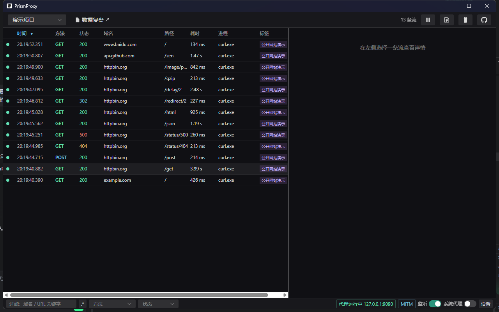
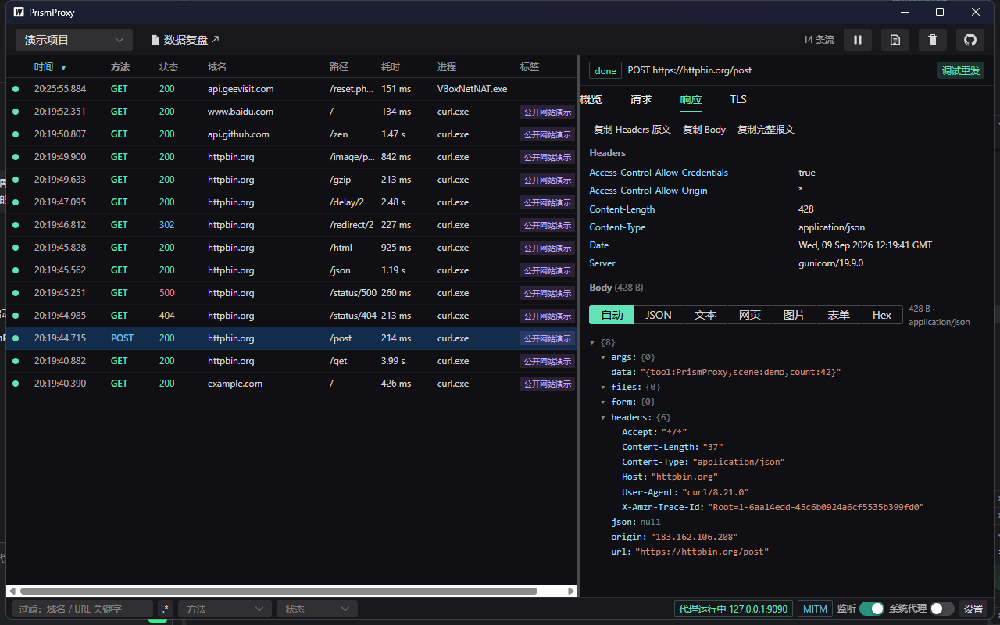
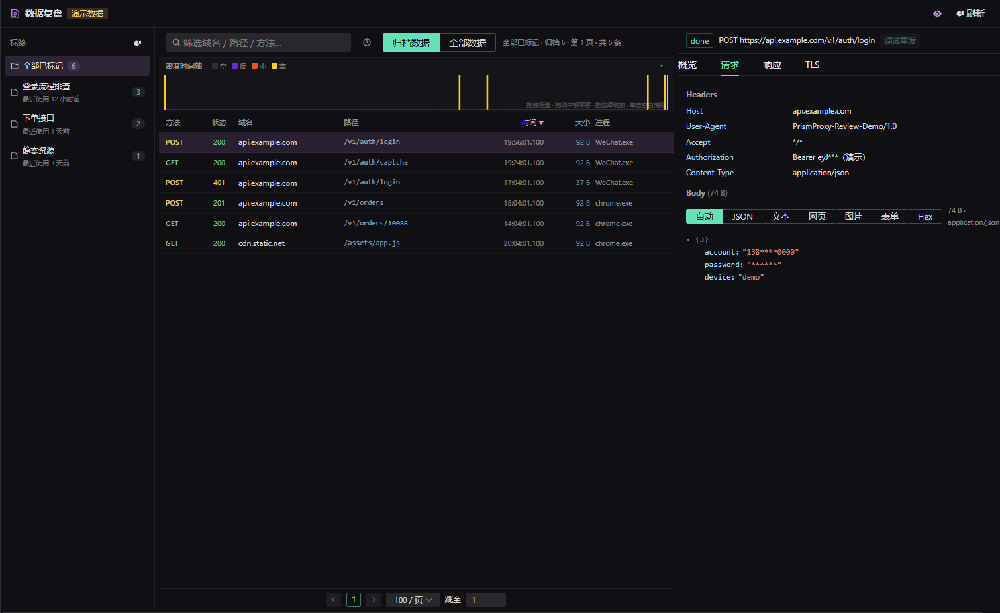
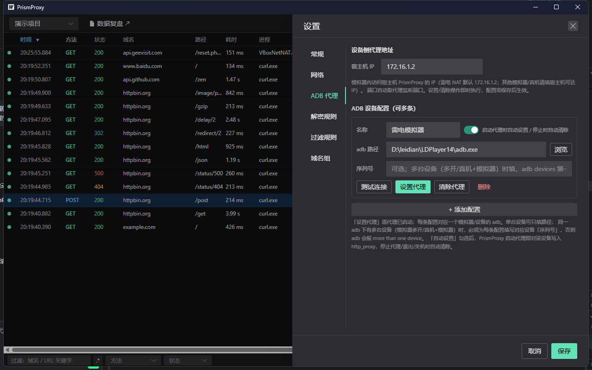

# PrismProxy
> 声明：本项目代码部分,完全由AI开发,人工只负责制定设计
```
    ╱╲
   ╱  ╲     P R I S M
  ╱ ◇◇ ╲    棱镜 · 代理抓包工具
 ╱  ◇◇  ╲   "让加密流量，现出原形"
╱_________╲
```

> 棱镜把混杂的白光分解为清晰可见的光谱 —— 正如本工具把加密混杂的网络流量解密为结构清晰、可读可查的请求列表。

PrismProxy 是一款**桌面级 HTTP(S) 调试代理**（Windows 优先），对标 Reqable，聚焦「**抓包 + 看包**」：轻、快、稳。单文件 exe，基于 MITM 中间人原理解密 HTTPS 流量，并支持按进程归因流量来源。

## 界面预览

**流量面板** — 实时列表，方法 / 状态码着色、进程归因、耗时与标签一目了然：



**流量详情** — 概览 / 请求 / 响应 / TLS 四栏检查，Body 多视图（JSON 树 / 原文 / Hex），一键调试重发：



**数据复盘** — 顶栏一键在系统浏览器打开独立复盘页：标签侧栏 + 时间轴直方图 + 归档流列表 + 详情三栏联动：



**设置 · ADB 设备代理** — 多模拟器 / 真机配置，一键写入全局 `http_proxy`：



## 功能特性

- **明文 HTTP 代理**：absolute-form 请求直接解析转发
- **HTTPS MITM 解密**：本地 Root CA + 按目标主机动态签发叶子证书（ECDSA P-256，LRU 缓存），握手失败域名自动降级盲透传（bypass）
- **进程归因**：通过 iphlpapi 端口→PID 映射，标记每条流量来自哪个进程（IPv4/IPv6 双栈）
- **流量面板**：实时列表 + 详情（Headers / Body / TLS 信息），增量推送，支持关键字/正则/方法/状态码过滤（方法与状态码多选）与置顶
- **流量持久化**：SQLite（modernc.org 纯 Go 驱动，无 CGO）异步落盘，重启后自动加载历史流量，可配置保留策略
- **数据复盘**：抓包打标签归档；顶栏「数据复盘」在系统浏览器开独立复盘页——标签侧栏 + 流列表 + 详情三栏，时间轴直方图拖拽选时间窗、页码分页、全库关键字搜索、多列排序、忽略名单（域名/路径/进程）、敏感凭据提示、调试重发
- **复盘 AI 分析**：四种模式——单接口功能解读、勾选流批量意图标注（缺正文自动提示补正文重析）、自然语言定位目标接口、业务链路整理；流式 Markdown 输出，OpenAI 兼容接口七服务商预设，密钥仅存本地、默认脱敏外发
- **多项目隔离**：规则组 / 域名组 / 归档库按项目独立存放，顶栏切换器一键热切换（代理不重启、配置不串）；无项目时显示欢迎页
- **ADB 设备代理**：一键给 Android 设备/模拟器写入全局 http_proxy 指向本机（支持多设备按 serial 选择）
- **过滤规则组**：多规则组黑白名单引擎（域名/进程/方法/状态码），支持导入导出
- **系统代理一键接管**：自动检测第三方代理占用
- **Composer 调试重发**：编辑请求参数后重发（主窗与复盘页均可用）
- **效率复制**：右键复制 URL / cURL（cmd / PowerShell / bash 三版单行输出）/ 详情复制，快捷忽略域名/路径/进程并自动清理命中流量
- **证书向导**：`http://127.0.0.1:9090/ca` 证书下载与安装指引页
- **AI CLI**：内置 `cli` 子命令控制运行实例（状态 / 流量 / 规则 / 系统代理 / 项目 / ADB / 配置 / UI），输出单行 JSON，面向 AI agent 与自动化脚本

## 技术栈与架构

| 项 | 内容 |
|----|------|
| 后端 | Go 1.27（代理引擎，核心零外部依赖） |
| 前端 | Vue 3 + TypeScript + Naive UI + Pinia + Vite |
| 桌面框架 | Wails v2（WebView2 渲染，Go Bindings + Events） |
| 持久化 | SQLite（modernc.org 纯 Go 驱动，无 CGO） |
| 平台 | Windows 10/11（依赖 WebView2 运行时，缺失时启动自检引导安装） |
| 默认端口 | 代理 9090（可配置）；控制 API 9595 |

```
┌──────────────────────────────────────────┐
│            PrismProxy.exe（单文件）        │
│  前端 Vue3（流量列表/详情/过滤/设置/复盘）   │
│            ▲ Wails Bindings + Events      │
│  Go Core：proxy 代理引擎 / mitm 证书中心    │
│      capture 会话捕获 / persist 持久化      │
└────────────────┬─────────────────────────┘
                 ▼
  客户端(手机/PC/模拟器) ──▶ :9090 ──▶ Internet
```

## 快速开始

### 运行

```bat
PrismProxy.exe              :: GUI 模式（默认，等价双击启动）
PrismProxy.exe -headless    :: 无界面模式（后台常驻，适合自动化）
```

可选参数：`-addr 127.0.0.1:9090` 指定监听地址，`-no-mitm` 关闭 HTTPS 解密。

### 抓 HTTPS 流量

1. 客户端信任本地 CA：访问 `http://127.0.0.1:9090/ca` 按指引安装证书（Windows 给出 `certutil` 免管理员命令）
2. 将客户端代理指向本机 9090 端口：
   - **手机/模拟器**：WiFi 代理或 `http_proxy` 指向 PC IP（注意：仅设 Windows 系统代理对雷电等 VBox NAT 模拟器无效，需在模拟器内设置）；也可用设置页「ADB」或 `cli adb set` 一键给 Android 设备写入全局代理
   - **桌面应用**：设置页开启「系统代理」一键接管，或以 `--proxy-server=127.0.0.1:9090` 启动目标应用

> **安卓抓包推荐使用模拟器**（如雷电等可 Root 的模拟器）：CA 可装入系统证书存储，所有 App 流量均可解密，抓包无死角。
> **Android 7+ 真机存在系统限制**：安装到「用户证书」的 CA 默认不被 App 信任——仅浏览器及少数主动声明信任用户证书的 App 可解密，绝大多数 App 的流量仍为 CONNECT 隧道盲透传。要在真机上全量解密，需 Root 后将 CA 装入系统证书，或重打包目标 App 修改 networkSecurityConfig。

### AI CLI

```bat
PrismProxy.exe cli status --pretty                 :: 实例总状态
PrismProxy.exe cli flows list --limit 5            :: 流摘要列表
PrismProxy.exe cli flows get <id> --body req       :: 请求体
PrismProxy.exe cli rules ignore host api.example.com  :: 快捷忽略域名
PrismProxy.exe cli sysproxy on                     :: 接管系统代理
PrismProxy.exe cli project list                    :: 项目清单
PrismProxy.exe cli adb set --serial <序列号>        :: 给 Android 设备写全局代理指向本机
PrismProxy.exe cli ui settings decrypt             :: 打开 GUI 设置面板
```

完整命令见 [doc/AI-CLI使用说明.md](doc/AI-CLI使用说明.md)。

## 构建与开发

环境要求：Go 1.27、Node.js、Wails CLI v2.15（`go install github.com/wailsapp/wails/v2/cmd/wails@latest`）、WebView2。

```bat
:: 一键构建（release，内嵌前端产物）
build.bat

:: 其他模式
build.bat nsis     :: 构建 + NSIS 安装包
build.bat debug    :: 调试构建
build.bat upx      :: UPX 压缩
build.bat clean    :: 清理产物
```

前端深度依赖 Wails 绑定（`wailsjs/go/main/App`、`wailsjs/runtime`），**纯 `npm run dev` 无法运行，调试必须用 `wails dev`**（前端热重载 + Go 热重载，`wails dev -d` 可挂 Delve 调试器）。

注意：构建前若 `PrismProxy.exe` 正在运行会因文件占用失败，先结束进程。

## 项目结构

```text
PrismProxy/
├─ main.go                  # 入口：cli 子命令分发 / GUI / -headless
├─ wails.json               # Wails 配置
├─ build.bat                # 一键构建脚本（release/nsis/debug/upx/clean）
├─ frontend/                # Vue3 + TS 前端
│  └─ src/
│     ├─ App.vue            # 主布局（顶栏状态 + 流列表 + 详情）
│     ├─ pages/             # 页面
│     ├─ components/        # 流列表/详情/设置抽屉/Composer 等
│     ├─ review/            # 数据复盘页（主窗内嵌为主要形态，另保留独立 Vite 入口 review.html）
│     └─ stores/            # Pinia 状态
├─ internal/
│  ├─ app/                  # App 装配、GUI/headless 启动、WebView2 自检
│  ├─ proxy/                # 代理引擎：CONNECT 分流 / MITM / 证书页
│  ├─ mitm/                 # Root CA 生成持久化 + 叶子证书动态签发
│  ├─ capture/              # Flow 捕获（tee 截断 body）
│  ├─ store/                # 流量存储（内存环形缓冲）
│  ├─ persist/              # SQLite 流量持久化（标签归档 / 历史加载 / 保留策略）
│  ├─ rules/                # 过滤规则组引擎 + 端口→PID 进程归因
│  ├─ procs/                # 进程信息
│  ├─ domains/              # 域名规则
│  ├─ settings/             # 配置读写（全局 + 多项目）
│  ├─ sysproxy/             # 系统代理接管/恢复
│  ├─ compose/              # Composer 重发
│  └─ ctlapi/               # AI CLI 控制面（127.0.0.1:9595 + token）
└─ doc/                     # 设计文档
```

## 文档

| 文档 | 内容 |
|------|------|
| [doc/方案.md](doc/方案.md) | 完整技术方案（定位 / 原理 / 模块设计） |
| [doc/开发进度.md](doc/开发进度.md) | 里程碑与任务级进度跟踪 |
| [doc/规则设计.md](doc/规则设计.md) | 过滤规则组设计 |
| [doc/项目配置设计.md](doc/项目配置设计.md) | 多项目隔离与热切换设计 |
| [doc/标签与数据复盘设计.md](doc/标签与数据复盘设计.md) | 标签归档与数据复盘页设计 |
| [doc/复盘AI分析设计.md](doc/复盘AI分析设计.md) | 复盘 × AI 分析（接口解读/智能定位/业务逻辑整理 + AI 接口配置，设计稿） |
| [doc/开发计划2.0.md](doc/开发计划2.0.md) | M13 复盘 × AI 分析实施计划（P0–P4 阶段任务与验收标准） |
| [doc/AI-CLI使用说明.md](doc/AI-CLI使用说明.md) | CLI 命令详解与输出示例 |
| [doc/CLI实时推送设计.md](doc/CLI实时推送设计.md) | CLI 实时流量推送设计 |
| [CONTEXT.md](CONTEXT.md) | 跨任务项目记忆（关键技术决策与排查记录） |

## Roadmap

### 数据复盘 × AI 分析（已实现，v2 分支）

在「数据复盘」中引入 AI 分析能力，让工具不只是记录流量，更能理解流量（设计详见 [复盘AI分析设计.md](doc/复盘AI分析设计.md)）：

- **接口功能解读**：对抓到的接口，由 AI 分析其功能、参数含义与调用时机
- **智能定位接口**：从一堆抓包记录中，按你描述的目标自动分析出你需要的接口，无需逐条翻找
- **业务逻辑整理**：梳理接口间的调用关系，自动产出结构化分析结果——如登录接口时序图、下单流程梳理等
- **批量意图标注**：勾选多条流量一次请求批量标注接口意图，低置信度或缺正文时提示一键补正文重析

## 免责声明

本工具仅用于**本地开发调试与授权测试**场景。请勿用于抓取、解密未授权的第三方流量，使用者需对自身行为负责。
